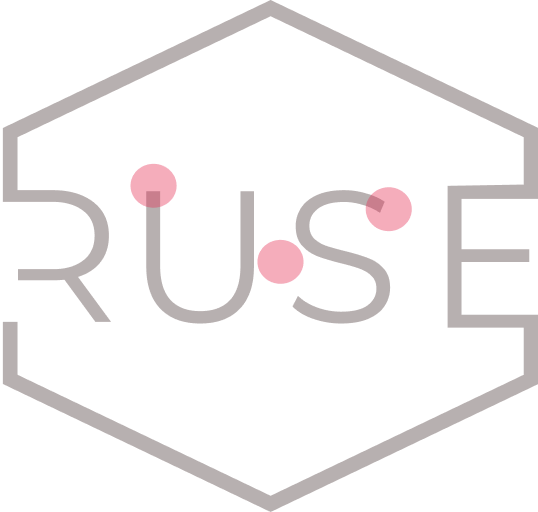
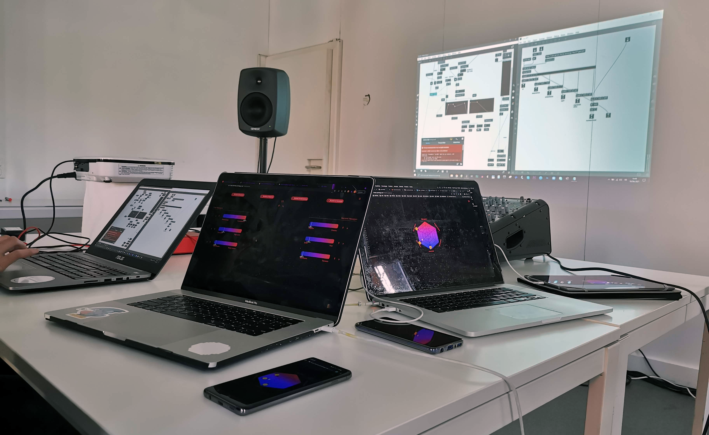

<h1 align="center">RUSE
<hr>A participatory art experience</h1>

<div align="center">

[//]: # (  )
  <br>
  <i><b>RUSE is a participatory art experience that transforms an electronic music concert into a creative and democratic process in which the audience is invested with an active role. During a live music performance, the audience can use their smartphones or computers to express their opinions about what they are hearing. The musician then can adapt their performance by observing their feedback in real time on a dedicated screen.</b></i>
</div>

<hr>
<div align="center">
  
  <i>RUSE in practice during a studio session: the RUSE application opened on smartphones and laptops (right) and the musician performing while observing the real-time audience aggregate feedback (left).</i>
</div>
<hr>

# How to run

## ruse-frontend

Install the dependencies as follows:

```
cd ruse-frontend
yarn install
```

Run the `frontend` locally using yarn with default port `3000`.

```
yarn start
```

## ruse-backend

Install the dependencies as follows:

```
cd ../ruse-backend
npm i
```

Run the `backend` locally using node with default port `5234`.

```
node server
```

# Docker

## Prerequisites

- Docker installed on the machine. To install Docker, follow the [official documentation](https://docs.docker.com/).

## Build and tag docker images

Build and tag docker image for the `frontend`.

```
cd ruse-frontend
docker build -t ruse-frontend:latest .
docker tag ruse-frontend:latest ruse-frontend:staging
```

Build and tag docker image for the `backend`.

```
cd ruse-backend
docker build -t ruse-backend:latest .
docker tag ruse-backend:latest ruse-backend:staging
```

## Run docker images

Once you built and tagged your docker images you can run both images with the `docker-compose` file.

```
docker compose up
```

Now, open [RUSE](http://localhost:3000) in browser.

# Pre-deployed version & Video Teaser

A pre-deployed version of RUSE is available [here](https://ruse.si.usi.ch). 

On [YouTube](https://youtu.be/NFbFRS4MNag) you can view a short teaser of RUSE in action at [ARS Electronica Lugano Garden 2021](https://www.usi.ch/en/feeds/16676).